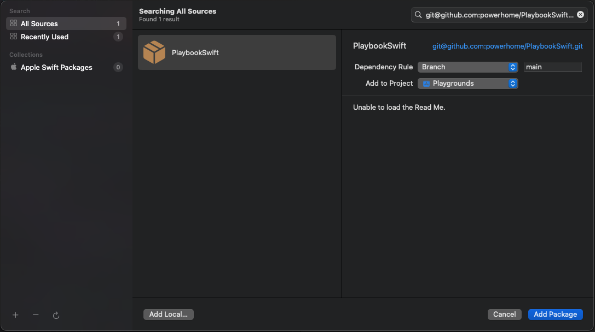
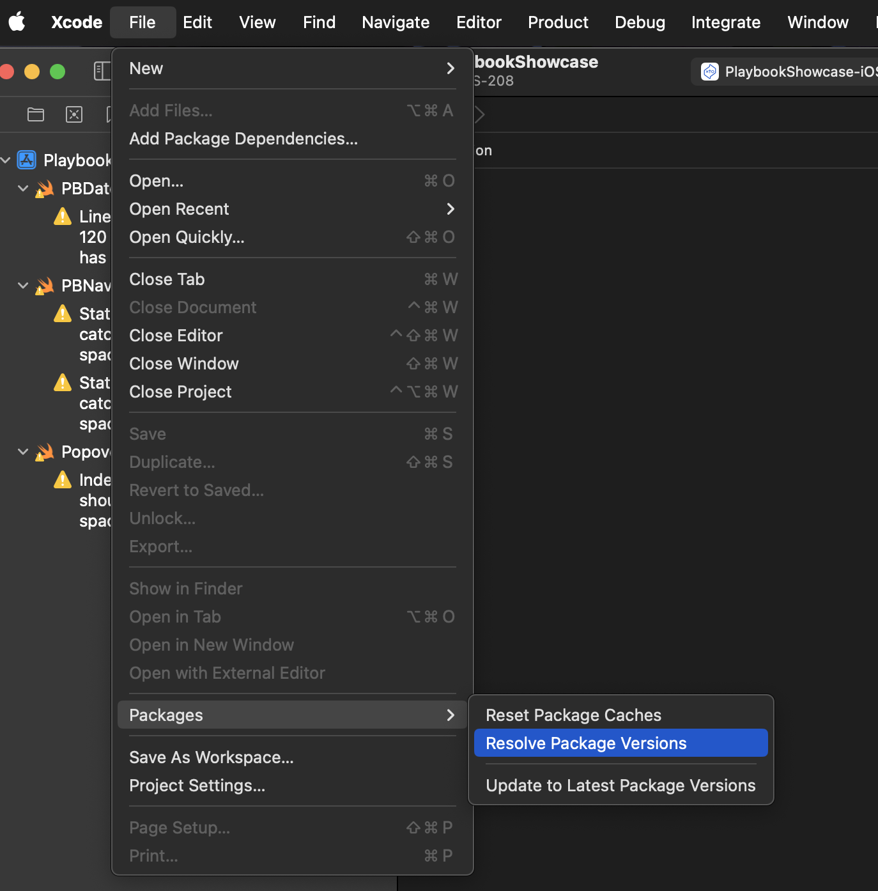

# Installation Guide for Playbook Swift

### Prerequisites

- [Xcode 15](https://developer.apple.com/xcode/)
- [Homebrew](https://brew.sh/)

### Playbook Swift can be added via the Swift Package Manager

<!---->


1. Search for: `git@github.com:powerhome/PlaybookSwift.git`
1. Choose `Add Package`
2. In Xcode, Choose `Packages > Resolve Package Versions`
   <!-- -->
3. In your Swift view file:
    ```swift
    import Playbook
    ```
5. Build the project

### Install [`pre-commit`](https://pre-commit.com/#install) via `brew install pre-commit`
  1. In the Playbook Swift root directory, run `pre-commit install` to set up the git hook scripts

### Note: YAML Configuration Files

- You may need to add the package like so:

```yaml
packages:
  Playbook:
    url: git@github.com:powerhome/PlaybookSwift.git
    version x.x.x // Where x.x.x is the desired version
```
