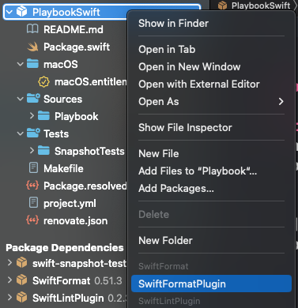
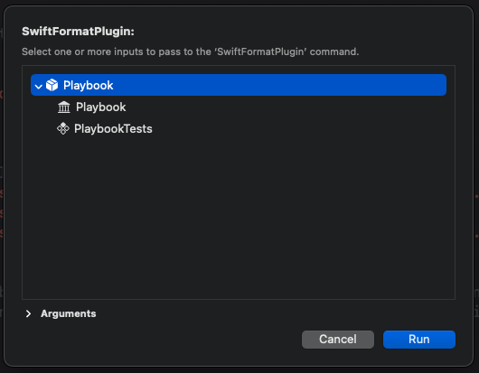
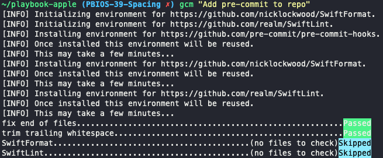
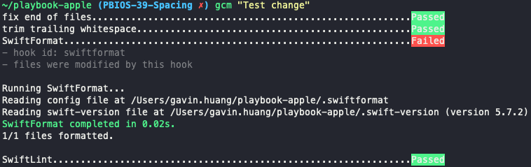

# Editing Linting, Formatting, and Auto Correction

In addition to the default linting rules, Playbook Swift enforces a indentation width of 2 spaces.

* [SwiftLint](https://github.com/realm/SwiftLint), within the `.swiftlint.yml` file, enforces the `indentation_width: 2` rule
  * View all enforced rules via `swiftlint rules` in your Terminal
* [SwiftFormat](https://github.com/nicklockwood/SwiftFormat), within the `.swiftformat` file, only allows the `indent` rule and sets it to `--indent 2`
  * To run SwiftFormat manually, use the plugin:
    * Right click `PlaybookSwift` in the Project Navigator
    * Click SwiftFormatPlugin
 
    * Click Run
 

These rules will also be enforced before you commit via [pre-commit](https://pre-commit.com/).

* After installing pre-commit via `brew install pre-commit && pre-commit install`, the first time you try to commit, it will take some time to install the hooks:
  

* pre-commit will check for several rules and auto-corrects any violations. You will have to commit again if it finds an error. In the example below, one file did not have proper indentation which SwiftFormat detected and corrected:
  
