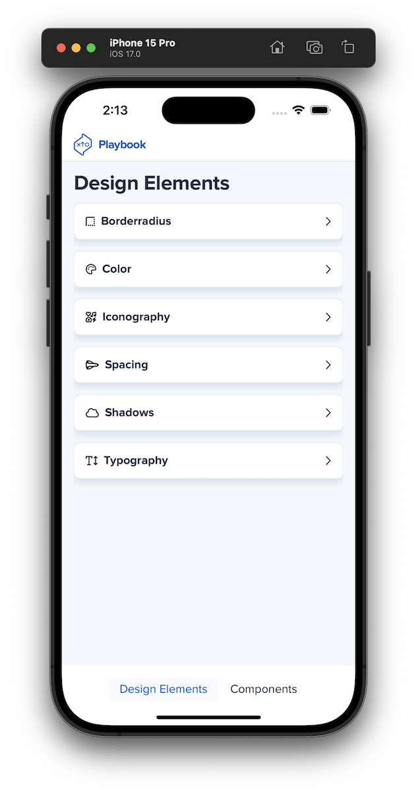

# Playbook Swift Design System 📱

Playbook Swift is the SwiftUI version of [Playbook](https://playbook.powerapp.cloud/), optimizing Playbook's designs for iOS & macOS apps. With Playbook Swift, all of Playbook's design components are now replicated for Apple's devices.

Built and maintained by the User Experience Team at [Power Home Remodeling](https://www.techatpower.com/).

>This project uses [FontAwesome Pro](https://fontawesome.com/icons) icons and the [Proxima Nova](https://www.marksimonson.com/fonts/view/proxima-nova) font, both of which are licensed by Power Home Remodeling and used for demonstrative purposes. Consumers of this project are required to secure >their own license for use.

## Installation

Follow our [installation guide](Installation.md) to setup Playbook Swift in your project.

## Component Examples via demo app (PlaybookShowcase)

Playbook Swift contains the app named `PlaybookShowcase`; providing examples of each component. PlaybookShowcase can be launched within the XCode simulator, side-loaded, or downloaded to your device.

# Contributions

Want to contribute to Playbook Swift? Check out our [contribution guidelines](Contribution.md) to better understand how you can help grow our library.

